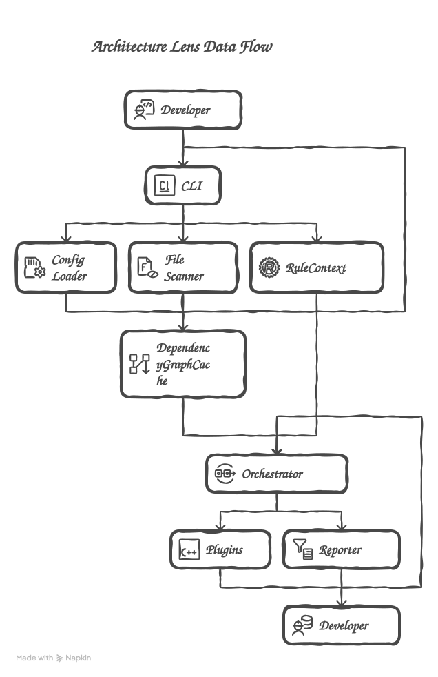

# Arch-Lens

> **Conventions should be enforced by tools, not by humans.**

[](https://github.com/katie0109/Arch-Lens/actions/workflows/ci.yml)
[](./LICENSE)


Arch-Lens는 TypeScript 코드베이스의 의존성 그래프를 만들고, 그 위에서 팀의 아키텍처 정책을 실행하는 **오픈소스 Rule Engine & CLI**입니다.

단순히 `A 폴더에서 B 폴더를 import하지 않는다`는 경계 규칙을 넘어, 다음처럼 그래프 탐색이 필요한 정책을 TypeScript 규칙으로 작성할 수 있습니다.

> 다른 팀의 legacy 영역에는 직접 또는 전이적으로 접근할 수 없고, 반드시 gateway를 거쳐야 한다. 마이그레이션 예외는 정해진 날짜에 자동 만료된다.

```console
$ arch-lens scan --report list
[Arch-Lens] ❌ [ERROR] [sample/gateway-only-access] "src/app/checkout.ts" reaches restricted
  "src/legacy/db.ts" without passing a gateway (src/app/checkout.ts → src/legacy/db.ts).
    ↳ Suggested fix: Route access through a gateway module, or add a dated waiver.
$ echo $?
1
```

> [!IMPORTANT]
> 공식 npm CLI 패키지는 `@moth-tools/arch-lens`이고 실행 명령은 `arch-lens`입니다. npm의 `arch-lens`, `arch-lens-cli`, `@arch-lens/cli`, `@arch-lens/core`는 이 프로젝트와 관계없는 패키지이므로 설치하지 마세요.

---

## 프로젝트를 만든 이유

프론트엔드 모노레포가 커지면 아키텍처 규칙은 문서와 코드 리뷰에 의존하기 쉽습니다.

- `feature`가 다른 feature의 내부 구현을 직접 참조하지 않는가?
- 오래된 모듈에 접근할 때 지정된 gateway를 거치는가?
- 신규 코드가 기존 순환 의존성을 더 악화시키지 않는가?
- 특정 팀이 소유한 영역을 다른 팀이 우회해서 사용하지 않는가?

경로 기반 DSL은 단순한 import 허용·금지에는 강하지만, 최단 경로·전이 의존성·소유권·만료일이 있는 예외처럼 **조직마다 다른 알고리즘**을 표현하기 어렵습니다.

Arch-Lens는 이 간극을 해결하기 위해 다음 구조를 선택했습니다.

```text
TypeScript source
    ↓ parse & resolve
File / Project dependency graph
    ↓ query API
Built-in rules + executable TypeScript plugins
    ↓
CLI report · CI gate · SARIF · baseline · affected scan
```

---

## 무엇이 다른가요?

Arch-Lens의 중심은 또 하나의 import 검사기를 만드는 것이 아니라, **전체 그래프 위에서 실행되는 규칙 런타임**을 제공하는 것입니다.

| 접근 방식 | 장점 | 제한 | Arch-Lens의 선택 |
| --- | --- | --- | --- |
| ESLint boundary rule | 에디터 피드백과 생태계 | 파일·import 단위 규칙에 적합 | 독립 CLI에서 전체 그래프 규칙 실행 |
| JSON/DSL 정책 | 안전하고 설정 공유가 쉬움 | 임의의 그래프 알고리즘 표현이 어려움 | TypeScript 함수로 규칙 작성 |
| Architecture test | 테스트 코드로 자유롭게 검사 | 별도 테스트 러너와 fixture가 필요 | 설정 기반 CLI와 플러그인 자동 로딩 |
| Nx 조직 규칙 | 프로젝트 그래프와 조직 정책 | Nx 및 상용 기능에 종속될 수 있음 | Nx 비종속 MIT 오픈소스 |

핵심 차별점은 다음 네 가지입니다.

1. **실행형 Rule Plugin** — 로컬 파일과 bare npm specifier에서 TypeScript/JavaScript 규칙을 로드합니다.
2. **Graph Query API** — 직접 의존성뿐 아니라 reachability, shortest path, SCC를 규칙에 제공합니다.
3. **점진적 도입** — baseline으로 기존 위반을 수용하고 신규 위반만 CI에서 차단합니다.
4. **CI 친화적 출력** — severity 기반 종료 코드, 단일 JSON, SARIF, affected 필터를 제공합니다.

---

## 대표 시나리오: gateway-only-access

[`examples/gateway-only`](./examples/gateway-only)는 Arch-Lens의 방향을 가장 잘 보여주는 예제입니다.

```ts
export default {
  plugins: ['../../packages/plugins/dist/sample/gateway-only-access.js'],
  rules: {
    'sample/gateway-only-access': [
      'error',
      {
        restricted: ['^src/legacy/'],
        gateways: ['^src/gateway/'],
        // 필요한 경우에만 기간 한정 예외를 활성화합니다.
        // waivers: [{
        //   from: '^src/app/checkout\\.ts$',
        //   until: '2026-12-31',
        //   reason: 'legacy migration',
        // }],
      },
    ],
  },
};
```

이 규칙은 다음을 함께 사용합니다.

- `graph.isReachable()`로 제한 영역 도달 여부 확인
- `graph.shortestPath()`로 위반 경로 제시
- gateway가 경로에 포함됐는지 검사
- 날짜가 지난 waiver 자동 무효화
- config options와 severity를 플러그인에 전달

```bash
pnpm build
./examples/gateway-only/scripts/run-arch-lens.sh
```

---

## 핵심 구현

### 1. TypeScript 의존성 그래프

TypeScript Compiler API의 module resolution을 이용해 상대 경로와 `tsconfig` path alias를 실제 파일로 해석합니다. 분석 결과는 안정적인 질의 인터페이스로 감쌉니다.

```ts
interface ArchitectureGraph {
  nodes(): GraphNodeId[];
  edges(): GraphEdge[];

  dependenciesOf(node: GraphNodeId): GraphNodeId[];
  dependentsOf(node: GraphNodeId): GraphNodeId[];
  isReachable(from: GraphNodeId, to: GraphNodeId): boolean;
  shortestPath(from: GraphNodeId, to: GraphNodeId): GraphNodeId[] | null;
  stronglyConnectedComponents(): GraphNodeId[][];
}
```

- BFS 기반 reachability와 shortest path
- Tarjan 알고리즘 기반 strongly connected components
- 파일 그래프를 config의 프로젝트 정의로 집계한 project graph
- mtime 기반 parse cache와 watch mode 무효화

### 2. ESLint식 규칙 설정

규칙별로 `off`, `warn`, `error`와 options를 지정합니다. warning만 있으면 CI는 통과하고 error가 하나라도 있으면 종료 코드 1을 반환합니다.

```ts
import type { ArchLensConfig } from '@moth-tools/arch-lens';

const config: ArchLensConfig = {
  include: ['src/**/*.{ts,tsx}'],
  exclude: ['**/dist/**', '**/__tests__/**'],
  plugins: ['./plugins/team-rules.mjs'],
  rules: {
    'structure/required-files': 'error',
    'structure/filename-case': [
      'warn',
      { rules: [{ test: '^src/components/.+\\.tsx$', style: 'pascal-case' }] },
    ],
    'team/gateway-only-access': ['error', { gateways: ['^src/gateway/'] }],
  },
};

export default config;
```

### 3. 안전한 fix 파이프라인

```text
detect → apply fixes → invalidate graph cache → rescan → report once
```

`--fix` 결과는 수정 전 위반이 아니라 **수정 후 남은 위반**을 기준으로 합니다. 규칙 실행 중에는 결과를 collector에 모으고, 최종 Reporter가 stdout에 한 번만 출력하므로 JSON 결과도 항상 하나의 문서로 유지됩니다.

### 4. 기존 코드베이스 도입 전략

- **baseline**: 현재 위반을 기록하고 이후 새 위반만 실패
- **affected**: 변경 파일과 전이 dependents에 해당하는 결과만 보고
- **CODEOWNERS**: 규칙에서 파일 소유 팀 조회
- **project graph**: 파일 그래프를 package/domain 단위로 집계
- **SARIF**: GitHub Code Scanning과 연동

```bash
arch-lens baseline
arch-lens scan --baseline
arch-lens scan --affected --since origin/main
arch-lens scan --report sarif > arch-lens.sarif
```

---

## 아키텍처



| 패키지 | 역할 |
| --- | --- |
| `@moth-tools/arch-lens` | `init`, `scan`, `baseline`, watch와 CLI lifecycle |
| `@moth-tools/arch-lens-core` | config, file scan, dependency graph, orchestrator, reporter |
| `@moth-tools/arch-lens-rules` | 공통 Rule/Graph 타입과 내장 규칙 8종 |
| `@moth-tools/arch-lens-plugin-kit` | `createRule`, `definePlugin`, 실행형 규칙 예제 |

```text
packages/
├── cli/
├── core/
├── rules/
└── plugins/

examples/
├── gateway-only/      # 전이 의존성과 waiver를 사용하는 대표 플러그인
├── ci-adoption/       # baseline, affected, SARIF
├── monorepo-sample/   # built-in rules와 auto-fix
└── plugin-demo/       # 로컬 플러그인 로딩
```

더 자세한 설계는 [`docs/architecture.md`](./docs/architecture.md)에서 확인할 수 있습니다.

---

## 실행하기

npm 베타 패키지를 개발 의존성으로 설치합니다. 패키지 이름과 실행 명령이 다른 점에 유의하세요.

```bash
pnpm add -D @moth-tools/arch-lens@beta
pnpm exec arch-lens init --config arch.config.ts
pnpm exec arch-lens scan
```

저장소에서 직접 개발하거나 예제를 실행하려면 다음 명령을 사용합니다.

```bash
git clone https://github.com/katie0109/Arch-Lens.git
cd Arch-Lens

pnpm install --frozen-lockfile
pnpm build

node packages/cli/dist/index.js --help
node packages/cli/dist/index.js scan examples/monorepo-sample/src \
  --report table \
  --allow-violations
```

설정 파일 생성과 기본 워크플로:

```bash
pnpm --filter @moth-tools/arch-lens exec arch-lens init --config arch.config.ts
pnpm --filter @moth-tools/arch-lens exec arch-lens scan
pnpm --filter @moth-tools/arch-lens exec arch-lens scan --fix
pnpm --filter @moth-tools/arch-lens exec arch-lens scan --watch
```

대표 예제를 한 번에 실행할 수도 있습니다.

```bash
./examples/gateway-only/scripts/run-arch-lens.sh
./examples/ci-adoption/scripts/run-arch-lens.sh
./examples/monorepo-sample/scripts/run-arch-lens.sh
```

---

## 제공 기능

### Built-in Rules

| Rule | 설명 | Fix |
| --- | --- | :---: |
| `structure/required-feature-index` | feature별 public entry point 강제 | ✓ |
| `structure/required-files` | 디렉터리별 필수 파일 검사 | ✓ |
| `structure/filename-case` | 파일명 casing 정책 | ✓ |
| `structure/no-loose-files` | 지정 루트의 loose file 방지 | ✓ |
| `dependency/no-cross-feature-import` | feature 간 내부 구현 직접 참조 차단 |  |
| `dependency/no-cross-layer` | layer별 허용 의존 방향 검사 |  |
| `dependency/no-circular` | 순환 의존성과 경로 탐지 |  |
| `dependency/allow-list` | 정규식 기반 dependency allow-list |  |

### Reporter & CI

- table, list, JSON, HTML, Markdown, SARIF
- severity 기반 종료 코드
- `--allow-violations`를 이용한 비차단 분석
- `--metrics` JSON 성능·위반 요약
- Node 20/22 GitHub Actions matrix
- packed tarball을 새 프로젝트에 설치하는 consumer smoke test

---

## 성능

합성 TypeScript 모노레포에서 `orchestrator.scan()`을 측정한 결과입니다.

| Files | Cold | Warm cache | Incremental / affected |
| ---: | ---: | ---: | ---: |
| 1,000 | 197 ms | 38 ms | 36 ms |
| 5,000 | 698 ms | 196 ms | 184 ms |
| 10,000 | 1,363 ms | 370 ms | 359 ms |

Apple M4 Pro, Node.js v26에서 측정했습니다. CLI 시작 시간은 제외되며 기기·규칙·그래프 형태에 따라 결과가 달라질 수 있습니다.

```bash
pnpm build
pnpm bench
```

측정 방법과 해석은 [`docs/benchmarks.md`](./docs/benchmarks.md)를 참고하세요.

---

## 검증과 품질 관리

```bash
pnpm build
pnpm lint
pnpm typecheck
pnpm test
pnpm coverage
bash scripts/consumer-smoke.sh
```

- Vitest unit/integration/CLI E2E 테스트 100개 이상
- first-party source만 측정하는 coverage threshold 60%
- 빌드된 실제 CLI를 임시 프로젝트에서 실행하는 E2E fixture
- Node 20/22 CI matrix
- tarball pack → clean install → `init`/`scan` consumer smoke test
- Conventional Commits와 기능 단위 PR 기록

---

## 설계상의 선택과 현재 한계

포트폴리오에서 결과만큼 중요한 것은 트레이드오프를 명확히 드러내는 것이라 생각해 현재 한계도 함께 기록합니다.

- **실행형 플러그인은 신뢰 경계입니다.** npm 플러그인은 일반 Node 코드와 같은 권한으로 실행되므로, 신뢰한 패키지만 사용해야 합니다.
- **현재 그래프는 파일·정적 import/export 중심입니다.** symbol-level dependency와 모든 dynamic import 패턴을 분석하지는 않습니다.
- **`--affected`는 영향 범위의 결과를 필터링합니다.** 그래프 구성과 전체 규칙 실행 자체를 완전히 생략하는 true affected execution은 후속 과제입니다.
- **baseline은 rule + file별 개수 기반입니다.** 라인 이동과 메시지 변경에는 강하지만 개별 위반 identity를 완전히 추적하지는 않습니다.
- **benchmark는 엔진 in-process 측정입니다.** 실제 CLI 성능에는 Node startup과 config/plugin loading 시간이 추가됩니다.

다음 마일스톤은 플러그인 실행 timeout/격리, symbol graph 확장, true affected execution입니다.

---

## 문서

| 문서 | 내용 |
| --- | --- |
| [`Getting Started`](./docs/getting-started.md) | 설치, 설정, scan/fix, CI 연결 |
| [`Architecture`](./docs/architecture.md) | orchestrator, graph, ownership, baseline 설계 |
| [`Rules Reference`](./docs/rules-reference.md) | 내장 규칙과 options |
| [`Plugin Guide`](./docs/plugin-guide.md) | 실행형 규칙과 플러그인 작성 |
| [`Benchmarks`](./docs/benchmarks.md) | 성능 측정 방법과 결과 |
| [`Contributing`](./CONTRIBUTING.md) | 개발 환경, 커밋, PR 가이드 |
| [`Changelog`](./CHANGELOG.md) | 버전별 변경 사항 |

---

## License

Arch-Lens is released under the [MIT License](./LICENSE).
