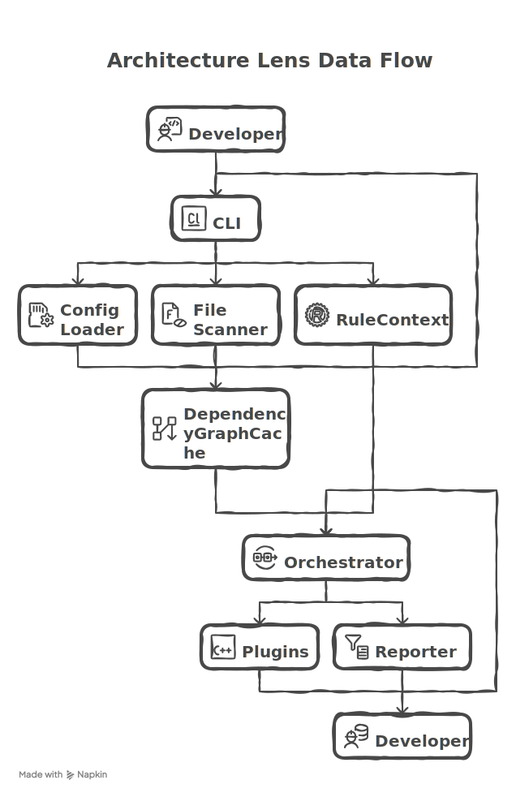

# Arch-Lens 시스템 아키텍처

Arch-Lens는 **CLI → Core Engine → Rules/Plugins → Reporter** 흐름으로 구성됩니다. 각 모듈은 새로운 규칙이나 리포터를 손쉽게 추가할 수 있습니다.

---

## 1. 실행 파이프라인 개요

---

## 2. 주요 모듈 상세

| 모듈 | 경로 | 설명 |
| --- | --- | --- |
| CLI | `packages/cli/src` | `cac` 기반 명령어 정의 (`scan`, `init`, `help`). `--plugin`, `--report`, `--watch`, `--metrics`, `--config` 등 옵션 처리 |
| Config Loader | `packages/core/src/config/load-config.ts` | `arch.config.ts`, `.js`, `.cjs`, `.mjs`, `.json`을 탐색 & ESM 동적 import |
| Config Scaffold | `packages/core/src/config/scaffold-config.ts` | `arch-lens init` 실행 시 템플릿 생성 + 기존 파일 백업 (`.bak`) |
| File Scanner | `packages/core/src/fs/file-scanner.ts` | `fast-glob`으로 include/exclude 패턴 기반 파일 수집 |
| Dependency Graph Builder | `packages/core/src/parser/ts-dependency-graph.ts` | TypeScript Compiler API로 import 그래프 생성 |
| DependencyGraphCache | `packages/core/src/parser/dependency-graph-cache.ts` | 파일별 `mtimeMs`를 기억하여 재사용 가능한 AST를 캐싱 |
| Rule Orchestrator | `packages/core/src/orchestrator/index.ts` | 규칙 실행 순서를 관리하고 `fix` 플래그에 따라 `rule.fix` 호출 |
| Reporter | `packages/core/src/reporter/console-reporter.ts` | table/list/json/html/markdown 출력, `suggestedFix` 노출, verbose 로깅 |

---

## 3. 캐싱 전략

- **입력:** 파일 목록과 각 파일의 `mtimeMs`.
- **동작:**
  1. `DependencyGraphCache`는 이전에 분석한 파일의 해시/mtime을 유지합니다.
  2. 동일한 `mtime`이면 파싱된 `RuleImportReference[]`를 그대로 재사용합니다.
  3. 변경된 파일만 AST를 다시 파싱하고, 그래프를 업데이트합니다.
- **효과:** Watch 모드에서 전달된 변경 파일만 그래프를 무효화하고 나머지는 캐시를 재사용합니다.

---

## 4. 플러그인 로딩 흐름

1. CLI의 `--plugin` 옵션 또는 `arch.config.ts`의 `plugins` 배열로 플러그인 경로를 명시합니다.
2. `packages/cli/src/utils/rule-loader.ts`가 ES Module / CommonJS 모두 로드 가능한 `import()` 전략으로 플러그인을 불러옵니다.
3. `definePlugin({ meta, rules })` 형식의 모듈이라면 `.rules` 배열을 추출하여 빌트인 규칙 리스트와 병합합니다.
4. 각 플러그인 규칙은 `PluginRuleContext`를 통해 `root`, `files`, `dependencyGraph`, `report`, `fix` 상태를 사용할 수 있습니다.
5. 플러그인에서 `context.report()`를 호출하면 Reporter 출력에 반영되어 CI 로그나 외부 시스템 연동이 용이합니다.

샘플 플러그인과 제작 튜토리얼은 [`docs/plugin-guide.md`](./plugin-guide.md)를 참고하세요.

---

## 5. Auto-fix 파이프라인

1. 사용자가 `arch-lens scan --fix`를 실행하면 `RuleContext.fix`가 `true`로 설정됩니다.
2. 구조 규칙들은 조건이 만족될 때 실제 파일 시스템 조작(`writeFile`, `rename`, `mkdir`)을 수행합니다.
3. 의존성 규칙들은 직접 수정 대신 `report()`를 통해 가이드 메시지를 출력합니다.
4. Reporter는 fix 단계에서 전달된 `RuleViolation[]`를 별도로 표시하여, CI에서도 수정 조치 여부를 확인할 수 있습니다.

---

## 6. Watch 모드 & Incremental Scan

- `arch-lens scan --watch`는 `chokidar`로 설정된 include 패턴을 감시하며, 이벤트가 발생하면 변경된 경로를 아키텍처 루트 기준 상대 경로로 정규화합니다.
- CLI는 200ms 디바운싱 후 `changedFiles` 배열을 `ArchLensOrchestrator.scan`에 전달하여 영향을 받은 파일만 캐시 무효화합니다.
- `DependencyGraphCache`는 전달된 파일의 AST만 다시 파싱하고, 나머지 그래프는 재사용해 재실행 속도를 높입니다.
- watch 모드에서도 위반 여부에 따라 exit code를 유지하므로 CI/로컬 모두 일관된 피드백을 제공합니다.

### 6.1 이벤트 디바운싱 & 로그

- 빠른 파일 저장이 연속으로 발생할 때를 대비해 이벤트를 200ms 동안 모아 한 번에 재스캔합니다.
- 콘솔 로그는 `Re-scanning after changes: ...` 형식으로 변경 파일을 보여주어 디버깅이 쉽습니다.

---

## 7. 실행 메트릭

- `arch-lens scan --metrics ./metrics.json` 옵션을 지정하면 스캔 결과 요약을 JSON으로 기록합니다.
- 생성되는 파일에는 `timestamp`, `durationMs`, `filesScanned`, `violationCount`, `byRule` 필드가 포함되어 CI 아티팩트나 대시보드로 전송하기 좋습니다.
- 지정한 경로의 디렉터리가 없으면 CLI가 자동으로 생성하며, 기존 파일은 새 결과로 덮어씁니다.

---

## 8. 레퍼런스
- [`docs/plugin-guide.md`](./plugin-guide.md) – 플러그인 제작 및 배포 가이드
